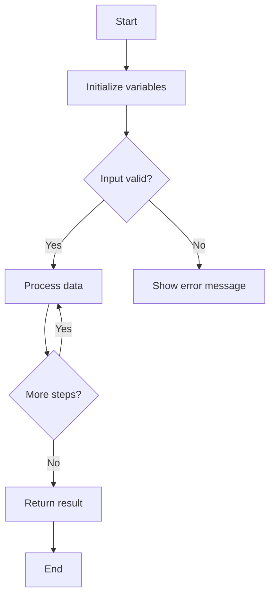

## request

```mermaid
flowchart TD
    A[Start] --> B[Initialize variables]
    B --> C{Input valid?}
    C -->|Yes| D[Process data]
    C -->|No| E[Show error message]
    D --> F{More steps?}
    F -->|Yes| D
    F -->|No| G[Return result]
    G --> H[End]
```
