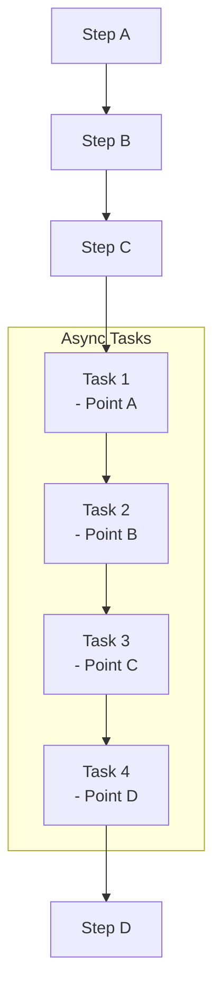

```mermaid
flowchart TD

    %% Main vertical flow
    A["Step A"] --> B["Step B"]
    B --> C["Step C"]

    %% Subgraph for async tasks (left-to-right flow)
    subgraph AsyncTasks[Async Tasks]
    direction LR
        T1["Task 1\n- Point A"] 
        T2["Task 2\n- Point B"]
        T3["Task 3\n- Point C"]
        T4["Task 4\n- Point D"]

        T1 --> T2 --> T3 --> T4
    end

    %% Connect C to the async subgraph
    C --> T1

    %% Back to normal vertical flow
    T4 --> D["Step D"]
```
