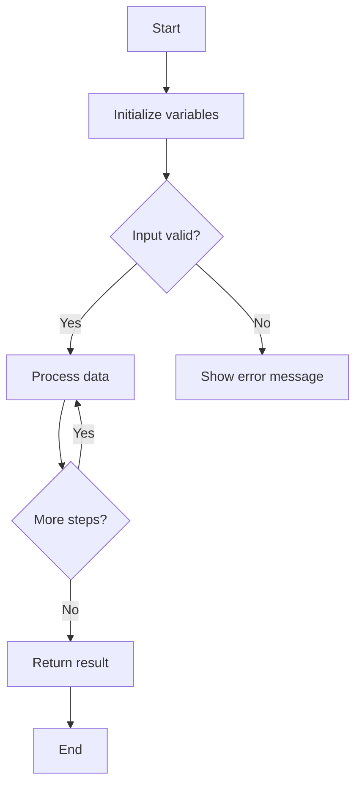
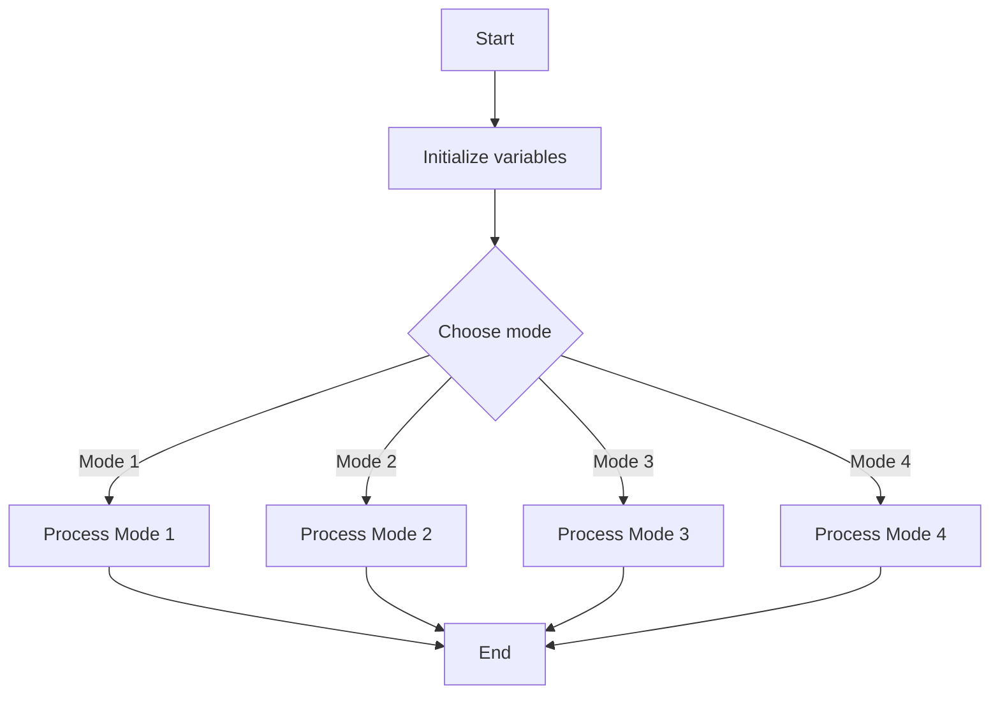
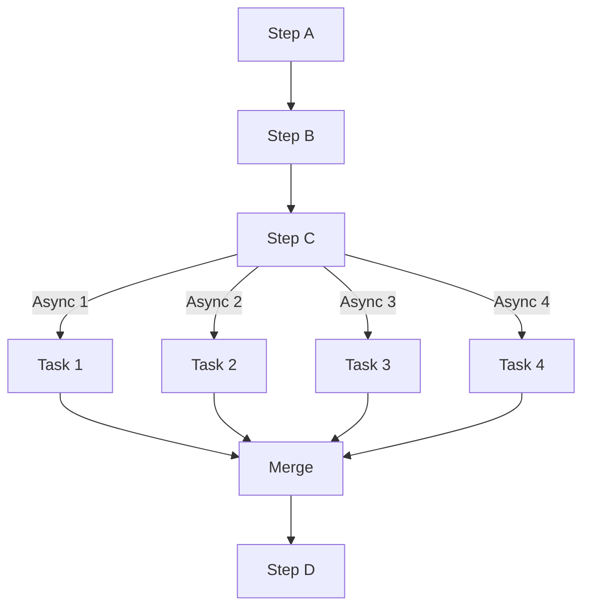
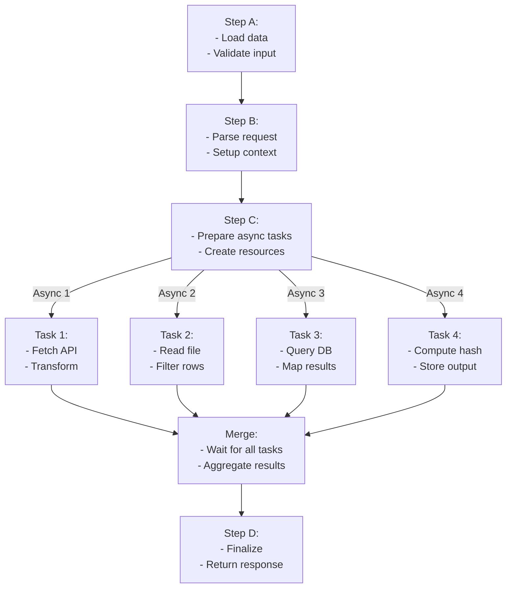

## request

```mermaid
flowchart TD
    A[Start] --> B[Initialize variables]
    B --> C{Input valid?}
    C -->|Yes| D[Process data]
    C -->|No| E[Show error message]
    D --> F{More steps?}
    F -->|Yes| D
    F -->|No| G[Return result]
    G --> H[End]
```

```mermaid
flowchart TD
    A[Start] --> B[Initialize variables]
    B --> C{Choose mode}

    C -->|Mode 1| D[Process Mode 1]
    C -->|Mode 2| E[Process Mode 2]
    C -->|Mode 3| F[Process Mode 3]
    C -->|Mode 4| G[Process Mode 4]

    D --> H[End]
    E --> H
    F --> H
    G --> H
```

```mermaid
flowchart TD
    A[Step A] --> B[Step B]
    B --> C[Step C]

    %% Four asynchronous tasks branching from C
    C -->|Async 1| T1[Task 1]
    C -->|Async 2| T2[Task 2]
    C -->|Async 3| T3[Task 3]
    C -->|Async 4| T4[Task 4]

    %% Optional: synchronize before D
    T1 --> M[Merge]
    T2 --> M
    T3 --> M
    T4 --> M

    M --> D[Step D]
```

```mermaid
flowchart TD
    A["Step A:\n- Load data\n- Validate input"] --> 
    B["Step B:\n- Parse request\n- Setup context"] -->

    C["Step C:\n- Prepare async tasks\n- Create resources"] 

    %% Async tasks with points inside
    C -->|Async 1| T1["Task 1:\n- Fetch API\n- Transform"]
    C -->|Async 2| T2["Task 2:\n- Read file\n- Filter rows"]
    C -->|Async 3| T3["Task 3:\n- Query DB\n- Map results"]
    C -->|Async 4| T4["Task 4:\n- Compute hash\n- Store output"]

    %% Merge
    T1 --> M["Merge:\n- Wait for all tasks\n- Aggregate results"]
    T2 --> M
    T3 --> M
    T4 --> M

    M --> D["Step D:\n- Finalize\n- Return response"]
```
