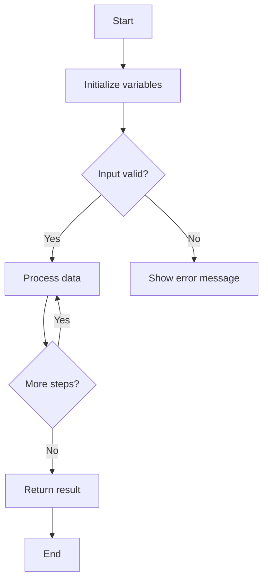
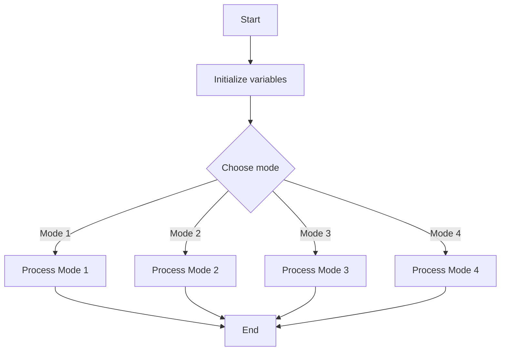

## request

```mermaid
flowchart TD
    A[Start] --> B[Initialize variables]
    B --> C{Input valid?}
    C -->|Yes| D[Process data]
    C -->|No| E[Show error message]
    D --> F{More steps?}
    F -->|Yes| D
    F -->|No| G[Return result]
    G --> H[End]
```

```mermaid
flowchart TD
    A[Start] --> B[Initialize variables]
    B --> C{Choose mode}

    C -->|Mode 1| D[Process Mode 1]
    C -->|Mode 2| E[Process Mode 2]
    C -->|Mode 3| F[Process Mode 3]
    C -->|Mode 4| G[Process Mode 4]

    D --> H[End]
    E --> H
    F --> H
    G --> H
```
