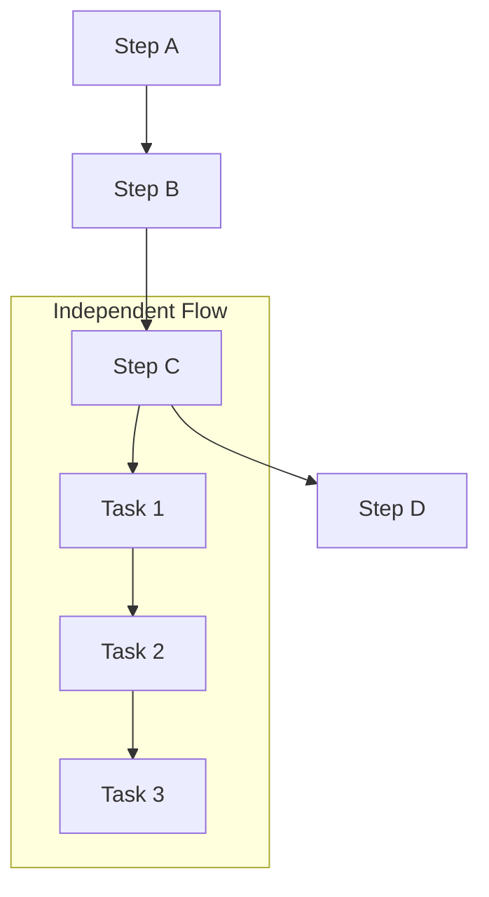

```mermaid
flowchart TD

    %% Main vertical flow
    A[Step A] --> B[Step B]
    B --> C[Step C]
    C --> D[Step D]

    %% Separate horizontal independent flow from C
    subgraph Independent_Flow[Independent Flow]
    direction LR
        C --> T1[Task 1]
        T1 --> T2[Task 2]
        T2 --> T3[Task 3]
    end
```
